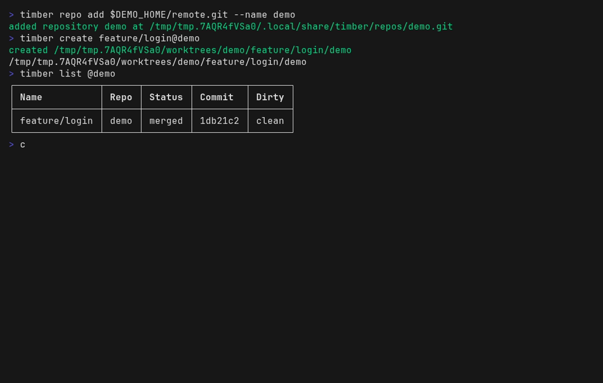

# timber

`timber` manages Git worktrees from registered bare repositories.

There is no required “main” worktree.
Repositories are stored as bare Git directories, and worktrees are created on demand under a shared root:

`<worktree-root>/<repo-name>/<worktree-name>/<repo-name>`

Defaults:

- bare repos: `$XDG_DATA_HOME/timber/repos/<repo-name>.git` (fallback: `~/.local/share/timber/repos/<repo-name>.git`)
- worktrees: `$TIMBER_WORKTREE_ROOT/<repo-name>/<worktree-name>/<repo-name>` (fallback: `~/worktrees/<repo-name>/<worktree-name>/<repo-name>`)

The worktree name and branch name are identical (including `/`).

Example:

- repo name: `timber`
- bare repo: `~/.local/share/timber/repos/timber.git`
- branch: `nn/my-feature`
- worktree path: `~/worktrees/timber/nn/my-feature/timber`

Use `timber repo import <path>` to register an existing clean clone and recreate its worktrees (including the former main checkout) in this layout.
When invoked through the shell wrapper (`t repo import <path>`), the shell also `cd`s to `$HOME` after success.

## Demo


Register a repository, create a worktree, inspect it with `list`, step
inside it, and remove it again. The still below shows `list` reporting a
`merged`, `clean` worktree:



Prefer video? [docs/demo/demo.mp4](docs/demo/demo.mp4) shows the same run.
All three are generated from [docs/demo/demo.tape](docs/demo/demo.tape); re-render them with `mise run demo` after changing the tape.

## Installation

Install using Go,

```bash
go install github.com/nnutter/timber@latest
```

`timber` requires Git on `PATH`.

## Herdr Plugin

Install the bundled [Herdr](https://herdr.dev) plugin with:

```bash
timber herdr install
```

That command writes the plugin to `~/.config/herdr/plugins/timber` (`$XDG_CONFIG_HOME/herdr/plugins/timber` when set) and runs `herdr plugin link` on the copy.
Copying the files is not enough on its own: Herdr only registers actions after `plugin link` or `plugin install`.
The popup runs `timber tui --herdr --no-title` after it adds common tool paths.
The TUI can create a new worktree or open a Herdr space for an existing one.
Worktree spaces open grouped under a parent space for the repository; the parent runs a `Status` tab that refreshes `timber list @<repo>` (with `--pr` when `gh` is authenticated).
The command prints a keybinding snippet to add to `~/.config/herdr/config.toml`:

```toml
[[keys.command]]
key = "prefix+shift+s"
type = "plugin_action"
command = "nnutter.timber.open"
description = "open or create Timber Space"

[[keys.command]]
key = "prefix+shift+d"
type = "plugin_action"
command = "nnutter.timber.delete"
description = "delete Timber worktree"
```

## Development

This repository uses [mise](https://mise.jdx.dev) for tools and tasks.

```bash
mise install
lefthook install
mise run all
```

`mise run all` runs formatting, fixes, tests, and static analysis.
`mise run format` (or `mise run fmt`) formats Go files.
`mise run fix` applies `go fix`, tidies the modules, and runs `go vet -fix`.
`mise run tests` (or `mise run test`) runs the Go and plugin shell tests with the race detector and shuffled test order.
Zsh completion tests also need `zsh`, `python3`, and PTY support; `mise run ci-tests` requires these dependencies rather than silently skipping those tests.
`mise run static-analysis` runs the configured static-analysis tools, including gitleaks.
`mise run coverage` (or `mise run cover`) runs the tests and prints coverage.
`mise run demo` re-renders the [demo](#demo) GIF, MP4, and still from `docs/demo/demo.tape` (needs a working Chrome for VHS).
`lefthook install` enables the pre-commit hook, which runs `mise run pre-commit` to format staged Go files.

## Shell integration

Generate a zsh function that wraps the CLI (default name `t`):

```bash
timber generate zsh
# or: timber generate zsh --name t --out $XDG_DATA_HOME/zsh/site-functions --force
```

The default command generates the wrapper `t`, the completion `_t`, and the autoload helper `_t_autoload`.
The helper starts with `#autoload t`, which lets `compinit` make `t` available without `source` or an explicit `autoload` command.
With `--name foo`, the command generates `foo`, `_foo`, and `_foo_autoload`, and the helper starts with `#autoload foo`.
Ensure the output directory is on `fpath` before zsh runs `compinit`, then restart zsh or run `compinit`.

The generated function:

- routes most commands to `timber` (`t create`, `t list`, `t prune`, …)
- after a successful `t create`, `cd`s into the new worktree unless `--no-cd`, `--herdr`, or automatic Herdr workspace creation applies
- provides a shell-only `switch` that `cd`s into a worktree
- `t switch -c` | `--create` creates the worktree first, then `cd`s, unless `--no-cd` or a Herdr space is opened
- `t switch <name>` uses that worktree if the name exists in exactly one registered repository
- `t switch <Tab>` completes worktree names from every registered repository
- Unique names complete without `@`
- If a name exists in more than one repository, completion offers `<name>@<repo>` for each one (`artisinal@liaison`, `artisinal@persona`)
- after a successful `t remove` or `t repo import`, `cd`s to `$HOME`

```bash
t repo add nnutter/timber
t create feature/login@timber   # then cd into it
t create @timber                # random name, then cd into it
t switch feature/login@timber
t switch feature/login          # unique name across repositories
t switch -c feature/new@timber  # create then cd
t switch feature/new@timber -c  # same; -c can follow the name
t tui                           # open an existing worktree or create a new one
t herdr install                 # install the Herdr plugin
t herdr space                   # current worktree
t herdr space feature/login@timber
t create --no-cd other@timber   # create only
t remove feature/login          # then cd $HOME
t list
t list @timber
```

## Commands

The following aliases are available for the commands below:

| Command | Alias |
| --- | --- |
| `list` | `ls` |
| `prune` | `clean` |
| `remove` | `rm` |

The nested command groups have these aliases as well:

- `repo list` → `repo ls`
- `repo remove` → `repo rm`
- `repo rename` → `repo mv`

### Repository selection

Worktree commands take an optional `<worktree>@<repo>` qualifier on the name argument.

- `feature/login@timber` selects that worktree in the `timber` repository
- `feature/login` is enough when the name exists in exactly one registered repository
- `@timber` selects the repository with no worktree name (`create` generates a random name; `list` and `prune` pin that repository)

`list` and `prune` use every registered repository unless `@<repo>` pins one.

`create` (and `switch -c`) use the current repository when the cwd is a managed worktree of a registered repo, otherwise an interactive picker.
`remove` and `herdr space` with no name target the managed worktree that contains the cwd.

In non-interactive environments commands that need a single repository fail unless `@<repo>` is set or the cwd auto-detects a managed repo.

Worktree names must not contain `@`.

### Command summary

For full flags and examples, see `timber --help` and `timber <command> --help`.

| Command | What it does |
| --- | --- |
| `repo add` | Register a bare repository (GitHub `owner/repo` shorthand supported) |
| `repo list` | List registered repositories with aliases and origin URLs |
| `repo import` | Convert an existing clone into a managed repository |
| `repo remove` | Unregister a bare repository once its worktrees are gone |
| `repo rename` | Rename a repository and move its worktree directories |
| `create` | Create a worktree for a branch (`--no-herdr` skips the Herdr space) |
| `switch` | Shell-only: `cd` into a worktree, creating it first with `-c` |
| `tui` | Interactively open an existing worktree or create a new one |
| `herdr install` | Install the bundled Herdr plugin |
| `herdr space` | Open a Herdr Agent + Shell space for a worktree |
| `list` | List worktrees with merge/dirtiness status (`--json`, `--pr`, `--sort`) |
| `prune` | Remove clean, merged worktrees (`--dry-run`, `--prompt`) |
| `remove` | Remove one worktree and delete its branch (`--force` overrides safety) |
| `todo` | Open the current worktree's `TODO.md` in `$EDITOR` |
| `generate zsh` | Generate the `t` wrapper, completion, and autoload helper |

## Typical Flow

```bash
# once: install wrapper
timber generate zsh

# register a repo
t repo add nnutter/timber

# day to day
t create feature/login@timber
t switch feature/login@timber
# ... work ...
t switch main@timber   # if you created a main worktree
t prune @timber
# or:
t remove feature/login
```
